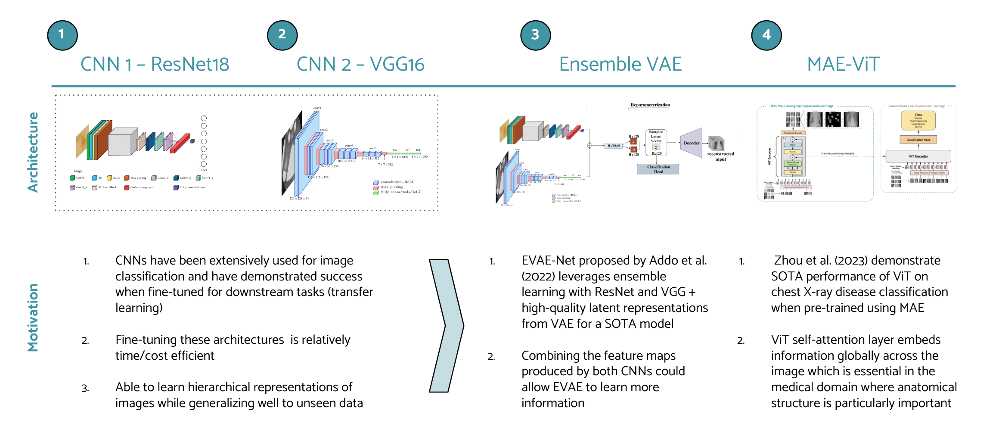

## Diagnosing Respiratory Disease from Chest X-Rays using Computer Vision

## Problem
We seek to classify common respiratory diseases (viral pneumonia, lung opacity, COVID, and normal) from chest x-ray images via a survey of supervised and self-supervised methods. 

## Approach


## Structure
As different individuals worked on the various approaches, each of the notebooks under ```models``` is self-sustained. We have also provided a ```requirements.txt``` which contains all of the necessary dependencies. Each of the models can be run on Google Colab. While the CNN models (ResNet18 and VGG16) can train on a cpu, EVAE and MAE require a gpu for training.
```
diagnosing_respiratory_disease_cv
│   README.md
└───requirements.txt
└───models
│   └───baseline_models.ipynb
│   └───resnet_vgg.ipynb
│   └───evae.ipynb
│   └───mae_vit.ipynb
```

## Instructions for use:
1. baseline_models.ipynb
- Set the path to the COVID-19 Radiography Dataset in the first code block under section 1. Read / Format Data.
  - The pathway should include everything except the name of the folder where the data is stored
  - An example of a correctly formatted data path is given in the notebook.

2. resnet_vgg.ipynb
- Select the desired options for classification task, model type, and training task
  - Classification options: ['multiclass', 'binary']
  - Model options: ['resnet', 'vgg']
  - Training options: ['finetune', 'scratch']

3. evae.ipynb
4. mae_vit.ipynb

